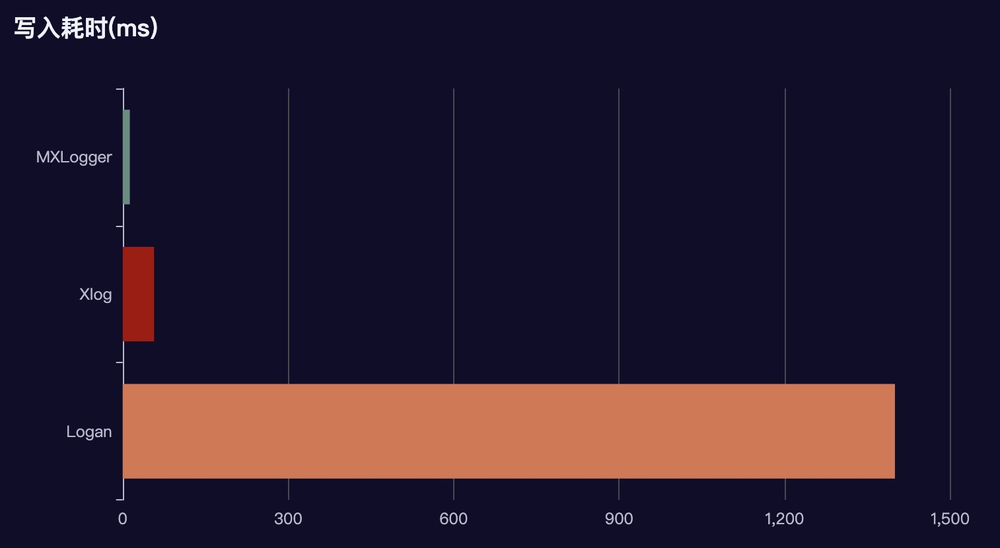

[](https://github.com/coder-dongjiayi/MXLogger/blob/main/LICENSE.TXT)    [](https://github.com/coder-dongjiayi/MXLogger)

<p align="center" >

</p>

# MXLogger

MXLogger 是基于mmap内存映射机制的跨平台日志库，支持AES CFB 128位加密，支持iOS Android Flutter。核心代码使用C/C++实现， Flutter端通过ffi调用，性能几乎与原生一致。 底层序列化使用Google开源的flat_buffers实现，高效稳定。

<!--ts-->

* [起因](#起因)

* [性能测试](#性能测试)

* [MXLogger介绍](#MXLogger介绍)

* [安装引入](#安装引入)

  

<!--te-->


### 整体结构如下


MXLogger 目前主要是解决日志写入和日志分析的问题。至于日志上报时机，应该由业务决定，MXLogger已经把日志的路径暴露出来，需要开发调用原生平台的文件上传代码，传到自己的服务器，然后通过自己的服务器下载日志文件，再通过我提供的**mxlogger_analyzer ** 进行解析。如果觉的这个流程麻烦，也可以自己写web端的可视化页面，解析代码可以查看 **mxlogger_analyzer** 的源码。


# 性能测试 

### 对比了一下 美团的 Logan-ios(1.2.2)

下面测试结果从三个维度进行比较 写入速度、内存波动、日志体积。以下仅为iOS端测试结果。

> 测试环境

* 测试设备 iphone8pluse 系统版本 14.0

* 每条数据大小约为104个字节 for循环10万次

* 测试10次，取平均值

> 测试结果

* 写入速度  MXLogger 仅为0.3s 左右，Logan平均在31s左右

  

* 内存波动  下图为写入10万条数据内存波动截图


MXLogger | Logan 
---- | ---
 |  
内存波动比较小 100k左右 | 内存波动比较大 将近40M 


> 日志文件体积

Logan 对数据进行了压缩，实际产生的体积会比较小。 MXLogger 仅仅对数据进行了二进制序列化，会比纯文本小一点。

MXLogger | Logan 
---- | ---
10M左右 | 1M左右


* 日志查看

   为了解析产出的二进制数据，我写了一个配套的可以查看的解析工具[mxlogger_analyzer](./mxlogger_analyzer.dmg),他大概长下面这个样子。
   [视频链接](https://user-images.githubusercontent.com/9606416/215237658-4f99fc51-4610-48c5-8803-daaf86400bf3.mp4)

https://user-images.githubusercontent.com/9606416/215237658-4f99fc51-4610-48c5-8803-daaf86400bf3.mp4


如果你使用的是Mac电脑你可以直接下载我写好的[客户端](https://github.com/coder-dongjiayi/MXLogger/blob/main/mxlogger_analyzer.dmg)，把dmg里面的app拖到应用程序目录中就可以了。如果你使用的是windows系统，那么你可能需要自行配置Flutter环境，编译mxlogger_analyzer的源码打包出exe文件。因为个人精力有限，我可能只会关注mac端的适配情况。如果你有特殊的需求分析，可以直接读取这个SQL数据库,通过操作sql进行自己的定制分析。

 如果你的工程是Flutter工程，你想在app内实时查看日志你可以在工程中依赖[mxlogger_analyzer_lib](https://pub.flutter-io.cn/packages/mxlogger_analyzer_lib)
 ```
 dependencies:
   mxlogger_analyzer_lib:^1.0.1
 ```
使用方法
  ```dart
   MXAnalyzer.showDebug(
                      _navigatorStateKey.currentState!.overlay!,
                      diskcachePath: _mxLogger.diskcachePath,
                      cryptKey: _mxLogger.cryptKey,
                      iv: _mxLogger.iv,
                      databasePath: "数据库路径")
  ```
 大概长下面这个样子 [视频链接](https://user-images.githubusercontent.com/9606416/215238043-e7199344-ba26-42a6-b8f3-421035cdb46a.mp4)
 

https://user-images.githubusercontent.com/9606416/215238043-e7199344-ba26-42a6-b8f3-421035cdb46a.mp4


# 安装引入

## iOS

``` pod 'MXLogger', '~> 1.2.2'```

## Android

``` implementation 'io.github.coder-dongjiayi:mxlogger:1.2.2'```

### Flutter

```
dependencies:
  flutter_mxlogger: ^1.2.2
```


# 快速开始

设置日志存储目录不要设置在一个可能被系统清理的目录 比如说 ios 的```library/cache```下，MXLogger并不会在每次写入数据的时候检测目录是否存在，只会在启动的时候创建，如果再app运行中日志文件被系统清理，程序不会报错，也不会闪退，但是日志也不会被记录。

更详细的使用，请查看demo

> 关于日志加密的说明

 MXLogger 提供AES CFB 128为加密机制，代码来自于[MMKV](https://github.com/Tencent/MMKV/tree/master/Core/aes)，加密逻辑使用汇编实现，最大程度保障了写入性能。加密使用的cryptKey和iv 应为长度16的英文字符串。


## 设置存储策略

> MXLogger 提供按月、周、天、小时，4种存储策略。默认情况下是按天存储。

```objective-c

	yyyy_MM                 按月存储
  yyyy_MM_dd              按天存储
  yyyy_ww                 按周存储
  yyyy_MM_dd_HH     		  按小时存储
```

> 初始化，以及基本使用

* iOS

  ```objective-c
  MXLogger * logger =  [MXLogger initializeWithNamespace:@"com.youdomain.logger.space",storagePolicy:MXStoragePolicyYYYYMMDD];
  logger.maxDiskAge = 60*60*24*7; // 一个星期
  logger.maxDiskSize = 1024 * 1024 * 10; // 10M
  logger.fileLevel = 0;// 设置文件写入等级 小于这个等级的日志 不写入文件
  
  [logger debug:@"mxlogger" msg:@"这是debug信息" tag:@"network,action"]; //多个tag可以使用,分割
  [logger info:@"mxlogger" msg:@"这是info信息" tag:@"request"];
  [logger warn:@"mxlogger" msg:@"这是warn信息" tag:@"step"];
  [logger error:@"mxlogger" msg:@"这是error信息" tag:@"action"];
  [logger fatal:@"mxlogger" msg:@"这是fatal信息" tag:@"reponse"];
  ```


* Android

  ```java
  MXLogger logger = new MXLogger(this.getContext(),"com.djy.mxlogger");
  logger.maxDiskAge = 60*60*24*7; // 一个星期
  logger.maxDiskSize = 1024 * 1024 * 10; // 10M
  logger.debug("request","mxlogger","this is debug",tag:"tag1,tag2,tag3");
  logger.info("response","mxlogger","this is info");
  logger.warn("tag","mxlogger","this is warn");
  logger.error("404","mxlogger","this is error");
  logger.fatal("200","mxlogger","this is fatal");
  ```

  

* Flutter

  ```dart
   MXLogger logger = await MXLogger.initialize(
          nameSpace: "flutter.mxlogger",
          storagePolicy: MXStoragePolicyType.yyyy_MM_dd,
          cryptKey: "abcuioqbsdguijlk",
          iv: "bccuioqbsdguijiv");
  
   logger.setMaxDiskAge(60*60*24*7);
   logger.setMaxDiskSize(1024*1024*10);
   logger.setFileLevel(0);
  
   logger.debug("这是debug数据", name: "mxlogger", tag: "tag1,tag2,tag3");
   logger.info("这是info数据", name: "mxlogger", tag: "w");
   logger.warn("这是warn数据", name: "mxlogger", tag: "w");
   logger.error("这是error数据", name: "mxlogger", tag: "e");
   logger.fatal("这是fatal数据", name: "mxlogger", tag: "f");
  
  ```
  


# 后续版本迭代安排

1. 日志文件压缩 
3. mxlogger_analyzer 支持根据tag搜索、分析数据
4. 强化控制台日志输出


# 参考代码

* [MMKV](https://github.com/Tencent/MMKV)
* [spdlog](https://github.com/gabime/spdlog)
* [log4cplus](https://github.com/log4cplus/log4cplus)
* [SDWebImage](https://github.com/SDWebImage/SDWebImage)
* [KSCrash](https://github.com/kstenerud/KSCrash)

   

   


