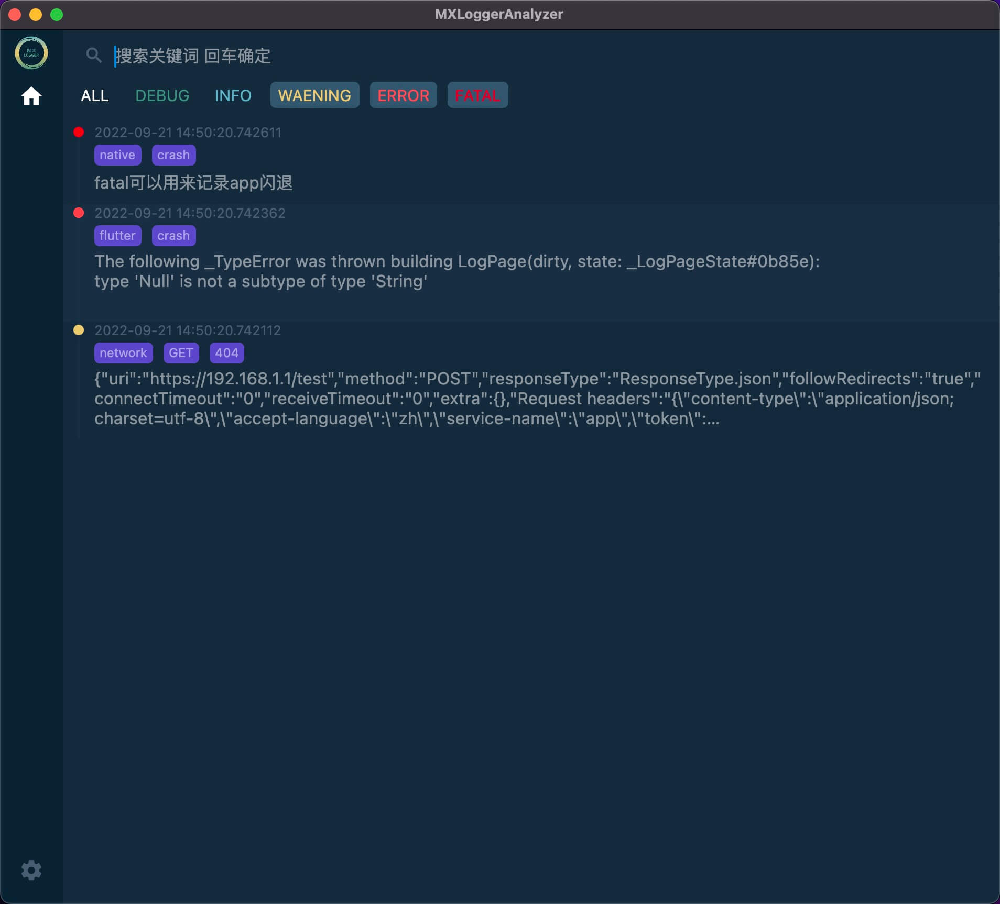
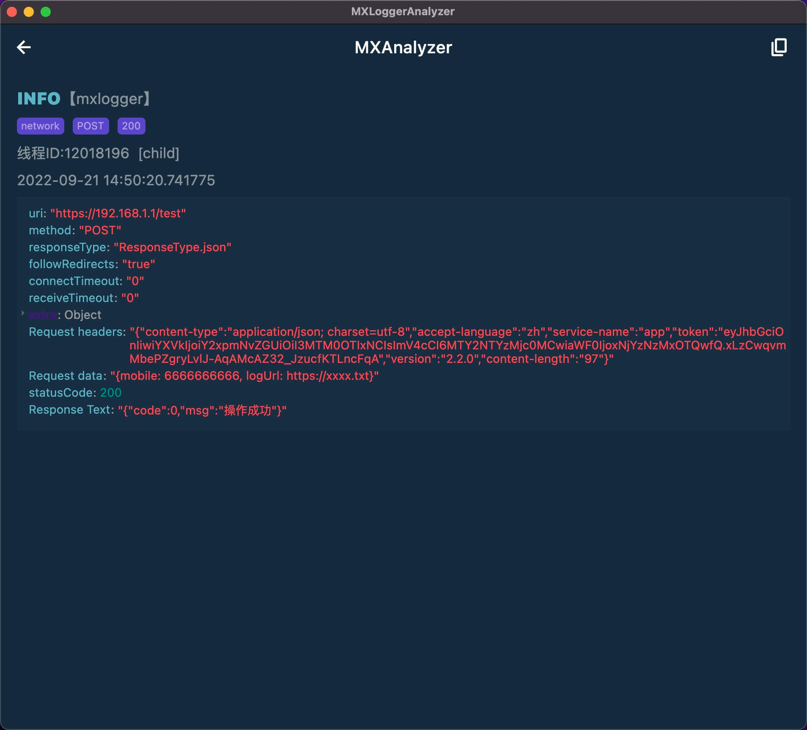

[](https://github.com/coder-dongjiayi/MXLogger/blob/main/LICENSE.TXT)    [](https://github.com/coder-dongjiayi/MXLogger)

<p align="center" >

</p>

# MXLogger

MXLogger 是基于mmap内存映射机制的跨平台日志库，支持AES CFB 128位加密，支持iOS Android Flutter。核心代码使用C/C++实现， Flutter端通过ffi调用，性能几乎与原生一致。 底层序列化使用Google开源的flat_buffers实现，高效稳定。

<!--ts-->

* [起因](#起因)

* [MXLogger介绍](#MXLogger介绍)

* [安装引入](#安装引入)

* [性能测试](#性能测试)

  

<!--te-->


### 整体结构如下


# 起因

当app用户量特别大的时候，异常的概率也越来越大。过去的一年多里我们收到了很多技术支持反馈的线上用户的问题，而这些问题绝大多数都是我们测试同学无法复现的。这个时候就需要开发同学根据代码逻辑进行推理、猜测、验证。把可能出现异常的地方记录下来，然后进行分析。早期的时候,我们记录日志的方式很原始，就是使用系统自带的api进行写入，产出txt文件。但是这种简单粗暴的方式，随着产品不断迭代，功能的增加，写入日志越来越频繁，日志文件越来越大。单纯依靠Ctrl+F搜索txt文件，很多时候不太容易追踪问题。我希望最终的日志产出能够导入数据库，通过sql进行数据的基本分析。最好能直接在app上看到日志（这样非常方便直接在测试期间查看问题）,于是我决定重新造一个轮子，既能保证写入效率和性能又能导入数据库进行基本的分析。

# MXLogger介绍


* 写入原理

  根据``mmap``映射原理，需要准备一页内存用于随时写入数据，操作系统负责将映射的内存写入到文件中，``mmap``的优势就在于不必担心app闪退导致日志丢失的问题。毕竟写日志的操作会贯穿app的整个生命周期。

* 数据信息

  ``MXLogger``写入的数据包括日志等级(``debug`` `` info``  ``warn``  ``error``  ``fatal``) 、日志写入时间(精确到微妙)、线程ID，是否为主线程、tag 以及日志信息等。底层序列化使用google开源的``flatbuffers``，其性能优于protobuf和json

* 设计模式

   MXLogger是使用多例的设计模式，日志存储路径是唯一实例。也就是说同一个存储路径在底层使操作的是同一个对象。在一个大型app中可能多个团队的代码会集成到同一个工程中，这个时候为了避免触碰到其他团队所使用的日志对象，我提供了一个命名空间的参数，通常可以使用域名反转的方式填入。通常日志操作会贯穿整个app的生命周期，为了使用起来简单方便，我建议使用者在自己的业务层进行单例的封装。

* 存储空间大小与写入效率

   **在存储空间和写入时间之间无法达成一个完美的解决方案，只能选择一个可以接受的折中方案 **

   

   使用flatbuffers序列化之后的二进制数据占用的存储空间会比纯文本要小。出于写入性能的考虑，我认为一边压缩数据一边写入并不是一个很好的解决方法。为此，我选择了性能，牺牲了存储空间。但毕竟手机存储空间还是有限的，如果多数的存储空间都被日志文件占用了，这是一个得不偿失的行为，也不可接受。为了缓解手机存储空间的问题我将使用以下两个办法

   1. 设置日志最大存储时长和最大存储大小，超过最大时长或最大存储大小的文件将会被删除。保留距离现在时间最近的日志。
   2. 对已生成的日志文件 进行整体压缩(待实现)

* 最大边界

   MXLogger理论上单条数据最大存储为2^32次方 也就是4GB，但是MXLogger并没有对最大值进行边界检查，如果你的单条数据存储大于了这个最大值，那么当前这个日志文件无法被解析。

* 日志查看

   为了解析产出的二进制数据，我写了一个配套的可以查看的解析工具[mxlogger_analyzer](./mxlogger_analyzer.dmg),他大概长下面这个样子。

|  |  |
|  ----  | ----  |
|  |  |


如果你使用的是Mac电脑你可以直接下载我写好的客户端(下载地址)，把dmg里面的app拖到应用程序目录中就可以了。如果你使用的是windows系统，那么你可能需要自行配置Flutter环境，编译mxlogger_analyzer的源码打包出exe文件。因为个人精力有限，我可能只会关注mac端的适配情况。目前这个工具的功能还比较单一，但是满足了基本的分析查询功能，后期我会逐渐完善这个分析工具。如果你有特殊的需求分析，可以直接读取这个SQL数据库,通过操作sql进行自己的定制分析。

mxlogger_analyzer 使用flutter编写，目前全平台支持，你也可以定制代码直接跑在自己的手机app上，实时查看日志数据。或者自己编译web版本部署在自己公司的服务器上。

# 安装引入


## iOS

``` pod 'MXLogger', '~> 0.1.2 '```

## Android

``` implementation 'io.github.coder-dongjiayi:mxlogger:0.1.2'```

### Flutter

没有往[pub](https://pub.flutter-io.cn/)上传，可以[下载源码](https://github.com/coder-dongjiayi/MXLogger/tree/main/flutter_mxlogger) 放到自己公司的git或者作为本地插件的形式集成到flutter工程中


# 性能测试

....

