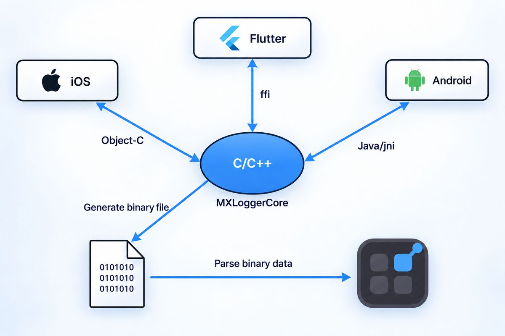
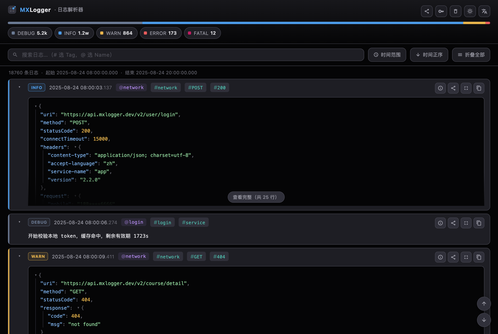
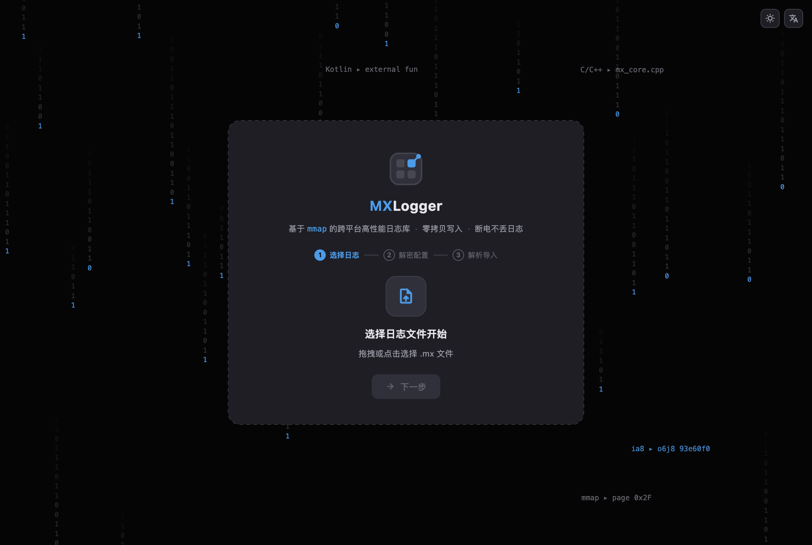
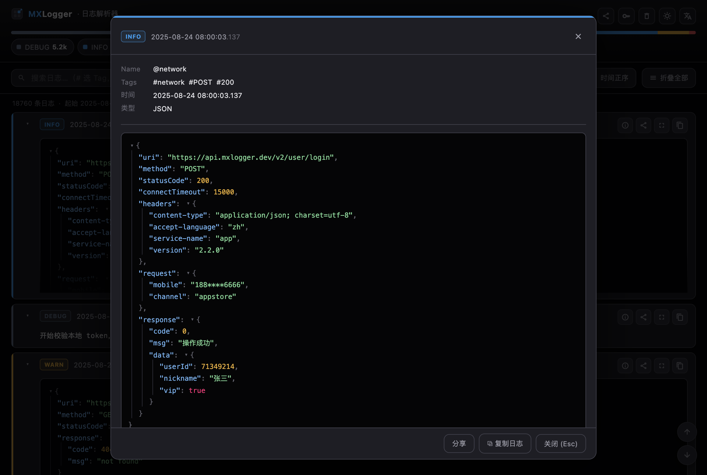
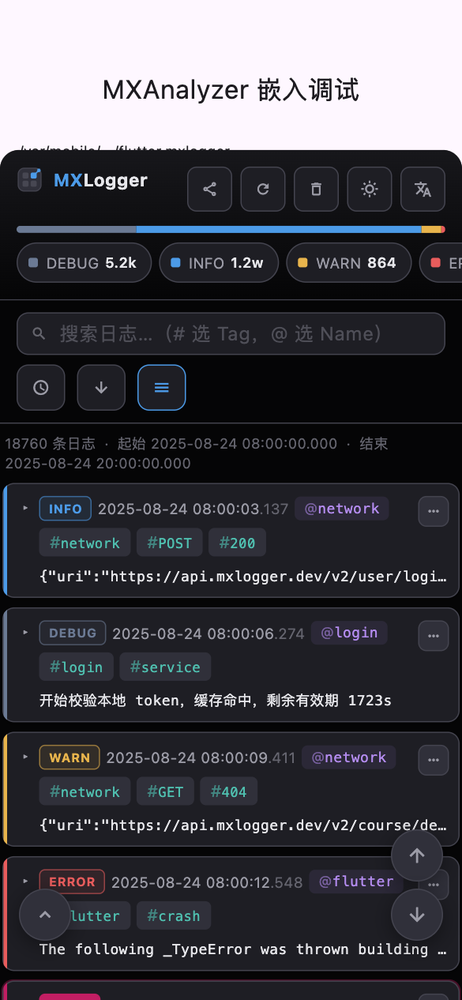
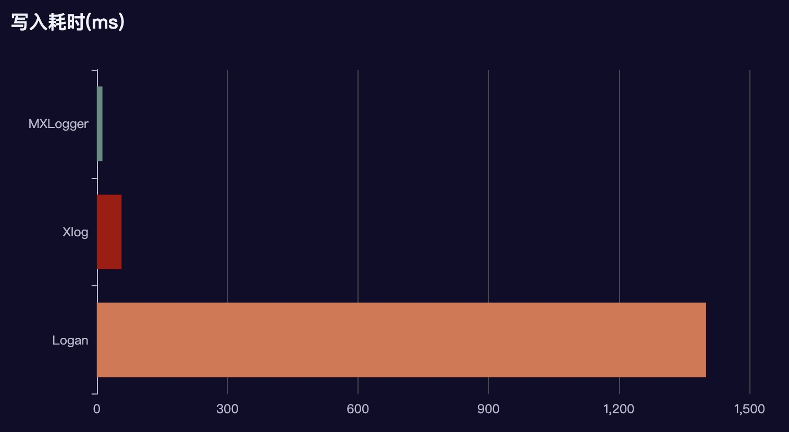

<p align="center">
  
  
  
  
</p>

<p align="center">
  <a href="https://github.com/coder-dongjiayi/MXLogger/blob/main/LICENSE.TXT"></a>
  <a href="https://cocoapods.org/pods/MXLogger"></a>
  <a href="https://central.sonatype.com/artifact/io.github.coder-dongjiayi/mxlogger"></a>
  <a href="https://pub.dev/packages/flutter_mxlogger"></a>
  <a href="https://pub.dev/packages/mxlogger_analyzer_lib"></a>
</p>

<p align="center" >

</p>

# MXLogger

MXLogger is a cross-platform logging library built on **mmap** memory mapping, with **AES-CFB-128**
encryption. The core is written in C/C++ and serializes records with Google **FlatBuffers**; the
Flutter side calls straight into it through `dart:ffi`, so performance is essentially identical to
native. Writing 100,000 records (~134 bytes each) takes about **0.13s** on an iPhone 11.

Along with the writers comes **mxlogger_analyzer**, an analyzer that imports, decrypts and searches
the produced `.mx` binaries — as a desktop app (macOS/Windows/Linux) or embedded straight into your
iOS/Android Flutter app as a floating ball.

中文说明请点击[这里](./README_CN.md)。

- [Log analyzer](#log-analyzer)
- [Install](#install)
- [Quick start](#quick-start)
- [API reference](#api-reference)
  - [iOS](#ios-api) · [Android](#android-api) · [Flutter](#flutter-api) · [Analyzer](#analyzer-api)
- [Storage policy and levels](#storage-policy-and-levels)
- [Performance](#performance)
- [Notes](#notes)

## Structure



MXLogger solves log **writing** and log **analysis**. When to upload logs is a business decision —
MXLogger exposes the log directory (`diskCachePath`), and you upload the files from the native
platform to your own server, then analyze them with mxlogger_analyzer.

---

# Log analyzer

`.mx` files are binary (AES-CFB-128 + flatbuffer), so they need a reader. The analyzer imports them
into sqlite, which backs full-text search, level/time/Tag/Name filtering and a JSON syntax tree view.

| Mode | What it is | How to get it |
| --- | --- | --- |
| Desktop app | macOS/Windows/Linux shell — drop or pick a log file | [Releases](https://github.com/coder-dongjiayi/MXLogger/releases) (built by CI for all three platforms) |
| Embedded in your app | floating ball + bottom sheet inside an iOS/Android Flutter app | `mxlogger_analyzer_lib` from pub.dev |

**Data page** — level distribution bar plus level chips, search and time filters, a syntax-colored
JSON tree inside every log card, click-to-filter `@name` / `#tag`, and per-record info / share /
fullscreen / copy. The top-right toggle switches to the light theme.



**Three-step first-run wizard** — ① drop or pick `.mx` files → ② configure the decryption KEY/IV
(several pairs allowed; the checkbox numbers are the order they are tried in) → ③ import with real
progress.



**Fullscreen detail of a single record** (Esc closes) — Name / Tags / time / level plus the complete
JSON tree, shareable or copyable as a whole.



**Embedded in a host app** (phone) — a bottom sheet covering 85% of the screen: tighter padding,
icons instead of labels, horizontally scrolling level chips, cards collapsed by default and actions
folded into the "⋯" menu.

<p align="center">

</p>

Full documentation for the analyzer: [mxlogger_analyzer_lib/README.md](./mxlogger_analyzer/mxlogger_analyzer_lib/README.md).

---

# Install

## iOS

```ruby
pod 'MXLogger', '~> 2.0.0'
```

## Android

```groovy
implementation 'io.github.coder-dongjiayi:mxlogger:latest.release'
```

## Flutter

```yaml
dependencies:
  flutter_mxlogger: ^2.0.0
  mxlogger_analyzer_lib: ^2.0.0   # optional: the in-app log viewer
```

The native dependencies are pulled in automatically — CocoaPods depends on `MXLogger` →
`MXLoggerCore`, Gradle on `io.github.coder-dongjiayi:mxlogger`.

---

# Quick start

## iOS

```objective-c
MXLogger *logger = [MXLogger initializeWithNamespace:@"com.yourdomain.logger"
                                      storagePolicy:MXStoragePolicyYYYYMMDD
                                           fileName:@"mxlog"
                                         fileHeader:@"{\"app_version\":\"2.0.0\"}"
                                           cryptKey:@"abcuioqbsdguijlk"   // 16 bytes
                                                 iv:@"bccuioqbsdguijiv"];

logger.consoleEnable = YES;                 // debug only — set NO for benchmarks / release
logger.maxDiskAge   = 60 * 60 * 24 * 7;     // keep at most 7 days
logger.maxDiskSize  = 1024 * 1024 * 10;     // use at most 10 MB
logger.level        = 0;                    // 0:debug — write everything to file

[logger debugWithName:@"login" msg:@"token check started" tag:@"login,service"];
[logger infoWithName:@"network" msg:responseJSON tag:@"network,POST,200"];
[logger warnWithName:@"network" msg:@"retry #2" tag:@"network"];
[logger errorWithName:@"flutter" msg:stack tag:@"crash"];
[logger fatalWithName:@"database" msg:@"connection lost" tag:@"db,fatal"];

NSLog(@"logs live in %@", logger.diskCachePath);
```

## Android

```java
MXLogger logger = MXLogger.initialize(
        context,
        "com.yourdomain.logger",              // nameSpace
        null,                                 // diskCacheDirectory — null = default
        MXStoragePolicyType.YYYY_MM_DD,
        "mxlog",                              // fileName
        "{\"app_version\":\"2.0.0\"}",        // fileHeader
        "abcuioqbsdguijlk",                   // cryptKey, 16 bytes
        "bccuioqbsdguijiv");                  // iv

logger.setConsoleEnable(true);
logger.setMaxDiskAge(60 * 60 * 24 * 7);
logger.setMaxDiskSize(1024 * 1024 * 10);
logger.setLevel(0);

// Android takes tag first: debug(tag, name, msg)
logger.debug("login,service", "login", "token check started");
logger.info("network,POST,200", "network", responseJson);
logger.warn("network", "network", "retry #2");
logger.error("crash", "flutter", stack);
logger.fatal("db,fatal", "database", "connection lost");

Log.d("MXLogger", "logs live in " + logger.getDiskCachePath());
```

## Flutter

```dart
final MXLogger logger = await MXLogger.initialize(
  nameSpace: "flutter.mxlogger",
  storagePolicy: MXStoragePolicyType.yyyy_MM_dd,
  fileHeader: jsonEncode(deviceInfo),
  consoleEnable: true,
  cryptKey: "abcuioqbsdguijlk",   // 16 bytes
  iv: "bccuioqbsdguijiv",         // defaults to cryptKey when omitted
);

logger.setMaxDiskAge(60 * 60 * 24 * 7);
logger.setMaxDiskSize(1024 * 1024 * 10);
logger.setLevel(0);

logger.debug("token check started", name: "login", tag: "login,service");
logger.info(jsonEncode(response), name: "network", tag: "network,POST,200");
logger.warn("retry #2", name: "network", tag: "network");
logger.error(stack, name: "flutter", tag: "crash");
logger.fatal("connection lost", name: "database", tag: "db,fatal");

debugPrint("logs live in ${logger.diskcachePath}");
```

---

# API reference

Common to all three platforms: a logger is identified by **nameSpace + diskCacheDirectory**, and the
underlying C++ instance is deduplicated on that pair. The md5 of the pair is the **loggerKey** —
pass it around a modularized app and write logs through the class methods without holding the logger
object.

<a name="ios-api"></a>
## iOS — `MXLogger` (Objective-C)

### Create and release

| API | Notes |
| --- | --- |
| `+ initializeWithNamespace:` | default directory `Library/com.mxlog.LoggerCache` |
| `+ initializeWithNamespace:fileHeader:` | with a file header |
| `+ initializeWithNamespace:cryptKey:iv:fileHeader:` | encrypted |
| `+ initializeWithNamespace:storagePolicy:fileName:fileHeader:` | policy + file name |
| `+ initializeWithNamespace:storagePolicy:fileName:fileHeader:cryptKey:iv:` | policy + encryption |
| `+ initializeWithNamespace:diskCacheDirectory:storagePolicy:fileName:fileHeader:cryptKey:iv:` | full parameters |
| `- initWithNamespace:fileHeader:` | instance initializers, same combinations |
| `- initWithNamespace:diskCacheDirectory:fileHeader:` | |
| `- initWithNamespace:cryptKey:iv:fileHeader:` | |
| `- initWithNamespace:storagePolicy:fileName:fileHeader:` | |
| `- initWithNamespace:diskCacheDirectory:storagePolicy:fileName:fileHeader:cryptKey:iv:` | designated initializer |
| `+ destroyWithNamespace:` | release by nameSpace (default directory) |
| `+ destroyWithNamespace:diskCacheDirectory:` | release by nameSpace + directory |
| `+ destroyWithLoggerKey:` | release by loggerKey |
| `+ valueForLoggerKey:` | fetch an existing logger, `nil` when none |

### Properties

| Property | Type | Notes |
| --- | --- | --- |
| `enable` | `BOOL` | master switch for writing |
| `consoleEnable` | `BOOL` | console output, off by default; stripped at compile time in Release/Profile (define `MXLOGGER_CONSOLE_ENABLED=1` to keep it) |
| `level` | `NSInteger` | minimum level written to disk, 0 debug … 4 fatal |
| `maxDiskAge` | `NSUInteger` | max age in seconds, 0 = unlimited |
| `maxDiskSize` | `NSUInteger` | max total size in bytes, 0 = unlimited |
| `shouldRemoveExpiredDataWhenEnterBackground` | `BOOL` | auto cleanup on entering background, `YES` by default |
| `diskCachePath` | `NSString` (readonly) | log directory |
| `logSize` | `NSUInteger` (readonly) | bytes currently on disk |
| `loggerKey` | `NSString` (readonly) | md5 of nameSpace + directory |

### Write

| API | Notes |
| --- | --- |
| `- logWithLevel:name:msg:tag:` | returns 0 on success, -1 expansion / -2 unmap / -3 mmap failed |
| `- debugWithName:msg:tag:` | level 0 |
| `- infoWithName:msg:tag:` | level 1 |
| `- warnWithName:msg:tag:` | level 2 |
| `- errorWithName:msg:tag:` | level 3 |
| `- fatalWithName:msg:tag:` | level 4 |
| `+ debugWithLoggerKey:name:msg:tag:` | write via loggerKey, no logger object needed |
| `+ infoWithLoggerKey:name:msg:tag:` | |
| `+ warnWithLoggerKey:name:msg:tag:` | |
| `+ errorWithLoggerKey:name:msg:tag:` | |
| `+ fatalWithLoggerKey:name:msg:tag:` | |

### Files, cleanup, parsing

| API | Notes |
| --- | --- |
| `- logFiles` | array of dicts: `name` / `size` / `last_timestamp` / `create_timestamp` |
| `- errorDesc` | description of the last write failure |
| `- removeExpireData` | delete expired files, then the oldest ones while over `maxDiskSize` |
| `- removeAllData` | delete every log file |
| `- removeBeforeAllData` | delete every file except the one being written |
| `+ selectWithDiskCacheFilePath:cryptKey:iv:` | parse a file into entries (newest first): `name` / `msg` / `tag` / `level` / `timestamp` / `thread_id` / `is_main_thread` / `error_code` |

### `MXStoragePolicyType`

`MXStoragePolicyYYYYMMDD` (daily, default) · `MXStoragePolicyYYYYMMDDHH` (hourly) ·
`MXStoragePolicyYYYYWW` (weekly) · `MXStoragePolicyYYYYMM` (monthly)

<a name="android-api"></a>
## Android — `com.dongjiayi.mxlogger.MXLogger` (Java)

### Create and release

| API | Notes |
| --- | --- |
| `MXLogger(Context, String nameSpace, String diskCacheDirectory, MXStoragePolicyType, String fileName, String fileHeader, String cryptKey, String iv)` | designated constructor |
| `MXLogger(Context, String nameSpace, String fileHeader)` | default directory |
| `MXLogger(Context, String nameSpace, String fileHeader, String cryptKey, String iv)` | encrypted |
| `MXLogger(Context, String fileHeader, String nameSpace, String diskCacheDirectory)` | custom directory |
| `static MXLogger initialize(Context, nameSpace, diskCacheDirectory, storagePolicy, fileName, fileHeader, cryptKey, iv)` | full parameters |
| `static MXLogger initialize(Context, nameSpace, fileHeader)` | |
| `static MXLogger initialize(Context, nameSpace, fileHeader, cryptKey, iv)` | |
| `static void destroy(Context, String nameSpace, String diskCacheDirectory)` | release by nameSpace + directory |
| `static void destroy(String loggerKey)` | release by loggerKey |

### Configuration and state

Configuration is never cached on the Java side — every getter queries native, the single source of
truth (several Java wrappers can share one native instance).

| API | Notes |
| --- | --- |
| `void setEnable(boolean)` / `boolean isEnable()` | master switch for writing |
| `void setConsoleEnable(boolean)` / `boolean isConsoleEnable()` | console output |
| `void setLevel(int)` / `int getLevel()` | minimum level written to disk, 0 debug … 4 fatal |
| `void setMaxDiskAge(long)` / `long getMaxDiskAge()` | max age in seconds, 0 = unlimited |
| `void setMaxDiskSize(long)` / `long getMaxDiskSize()` | max total size in bytes, 0 = unlimited |
| `long getLogSize()` | bytes currently on disk |
| `String getDiskCachePath()` | log directory |
| `String getLoggerKey()` | md5 of nameSpace + directory |
| `String getErrorDesc()` | description of the last write failure |

### Write

Note the parameter order — **tag comes first** on Android.

| API | Notes |
| --- | --- |
| `int debug(String tag, String name, String msg)` | level 0 |
| `int info(String tag, String name, String msg)` | level 1 |
| `int warn(String tag, String name, String msg)` | level 2 |
| `int error(String tag, String name, String msg)` | level 3 |
| `int fatal(String tag, String name, String msg)` | level 4 |
| `int log(String tag, int level, String name, String msg)` | returns 0 on success, -1 / -2 / -3 on failure |
| `static int log(String loggerKey, String tag, int level, String name, String msg)` | write via loggerKey |

### Files, cleanup, parsing

| API | Notes |
| --- | --- |
| `String[] logFiles()` | one JSON string per file: `name` / `size` / `last_timestamp` / `create_timestamp` |
| `void removeExpireData()` | delete expired files, then the oldest ones while over `maxDiskSize`. Android has no lifecycle hook — call it yourself (e.g. in `onStop`) |
| `void removeAll()` | delete every log file |
| `void removeBeforeAllData()` | delete every file except the one being written |
| `static String[] selectWithFilePath(String diskCacheFilePath, String cryptKey, String iv)` | parse a file, one JSON string per entry (newest first) |

### `MXStoragePolicyType`

`YYYY_MM_DD` (daily) · `YYYY_MM_DD_HH` (hourly) · `YYYY_WW` (weekly) · `YYYY_MM` (monthly)

<a name="flutter-api"></a>
## Flutter — `flutter_mxlogger`

Everything read and written goes through `dart:ffi`; the MethodChannel is only used to resolve the
platform default directory during `initialize`.

### Create and release

| API | Notes |
| --- | --- |
| `static Future<MXLogger> initialize({required String nameSpace, String? directory, bool consoleEnable = false, MXStoragePolicyType storagePolicy = yyyy_MM_dd, String? fileName, String? fileHeader, String? cryptKey, String? iv})` | recommended — resolves the platform default directory (iOS `Library/com.mxlog.LoggerCache/nameSpace`, Android `files/com.mxlog.LoggerCache/nameSpace`) |
| `MXLogger({required String nameSpace, required String directory, ...})` | synchronous constructor, requires an explicit directory |
| `static void destroy({required String nameSpace, String? directory})` | release; the matching Dart instances are invalidated first (no use-after-free) |
| `static void destroyWithLoggerKey(String loggerKey)` | release by loggerKey |

### Getters

| Getter | Type | Notes |
| --- | --- | --- |
| `enable` | `bool` | whether writing is on |
| `consoleEnable` | `bool` | whether console output is on |
| `diskcachePath` | `String` | log directory (directory + nameSpace) |
| `diskcacheErrorPath` | `String` | path of the local error file `error.txt` |
| `loggerKey` | `String?` | md5 of nameSpace + directory |
| `logSize` | `int` | bytes currently on disk |
| `logFiles` | `List<MXFileEntity>` | stored log files |
| `errorDesc` | `String?` | last native write error, `null` when none |
| `cryptKey` / `iv` | `String?` | the encryption parameters passed at initialization — hand them to the analyzer |

### Switches and disk management

| API | Notes |
| --- | --- |
| `void setEnable(bool enable)` | master switch for writing |
| `void setConsoleEnable(bool enable)` | console output; tree-shaken away in release/profile builds |
| `void setLevel(int lvl)` | minimum level written to disk, 0 debug … 4 fatal |
| `void setMaxDiskAge(int age)` | max age in seconds, 0 = unlimited |
| `void setMaxDiskSize(int size)` | max total size in bytes, 0 = unlimited |
| `void shouldRemoveExpiredDataWhenEnterBackground(bool should)` | auto cleanup on entering background, `true` by default |
| `void removeExpireData()` | delete expired files, then the oldest ones while over the size limit |
| `void removeAll()` | delete every log file |
| `void removeBeforeAllData()` | delete every file except the one being written |
| `int getLogSize()` / `String getDiskcachePath()` / `String? getLoggerKey()` / `List<MXFileEntity> getLogFiles()` | method forms of the getters above |

### Write

| API | Notes |
| --- | --- |
| `int debug(String msg, {String? name, String? tag})` | level 0 |
| `int info(String msg, {String? name, String? tag})` | level 1 |
| `int warn(String msg, {String? name, String? tag})` | level 2 |
| `int error(String msg, {String? name, String? tag})` | level 3 |
| `int fatal(String msg, {String? name, String? tag})` | level 4 |
| `int log(int lvl, String msg, {String? name, String? tag})` | returns 0 on success, -1 expansion / -2 unmap / -3 mmap failed |
| `static void logLoggerKey(String? loggerKey, int lvl, String msg, {String? name, String? tag})` | write via loggerKey |
| `static void debugLog(String? loggerKey, String msg, {String? name, String? tag})` | and `infoLog` / `warnLog` / `errorLog` / `fatalLog`, same shape |

### Recording write failures and parsing

| API | Notes |
| --- | --- |
| `void writeFail({required int code, required String errorDesc, String? other})` | call it when `log` returns non-zero; appends a JSON line to `diskcacheErrorPath` |
| `void deleteFailFile()` | delete the local error file |
| `void closeFailFile()` | close the error file's write stream |
| `static List<Map<String, dynamic>> selectLogmsg({required String diskcacheFilePath, String? cryptKey, String? iv})` | parse a file into entries (newest first): `name` / `msg` / `tag` / `level` / `timestamp` / `thread_id` / `is_main_thread` / `error_code`; `error_code == "1"` means that entry failed to decode (wrong cryptKey or iv) |
| `static List<Map<String, dynamic>> selectLogfiles({required String directory})` | **not implemented** — returns an empty list on every platform; use `logFiles` |

### `MXFileEntity`

`name` (`String?`) · `size` (`int`, bytes) · `createTimeStamp` / `lastTimeStamp` (`int`, seconds) ·
`createTime` / `lastTime` (`DateTime`, derived)

### `MXStoragePolicyType`

`yyyy_MM_dd` (daily, default) · `yyyy_MM_dd_HH` (hourly) · `yyyy_ww` (weekly) · `yyyy_MM` (monthly)

<a name="analyzer-api"></a>
## Analyzer — `mxlogger_analyzer_lib`

### Embedded in a host app: `MXAnalyzer`

| API | Notes |
| --- | --- |
| `static void initialize({String? databasePath, MXPrefs? prefs})` | optional pre-configuration: sqlite directory (defaults to `getApplicationSupportDirectory()`) and a persistence implementation for theme / locale / crypt pairs (memory only when omitted) |
| `static Future<void> showDebug(OverlayState overlayState, {required String diskcachePath, required List<MxCryptPair> cryptPairs, required MXShareHandler onShare, String? databasePath})` | show the floating ball (drag to move, tap to open the sheet, double tap to dismiss); calling again while it exists is ignored |
| `static void dismiss()` | remove the ball and release the database |

```dart
final GlobalKey<NavigatorState> navigatorKey = GlobalKey<NavigatorState>();
// MaterialApp(navigatorKey: navigatorKey, ...)

await MXAnalyzer.showDebug(
  navigatorKey.currentState!.overlay!,
  diskcachePath: logger.diskcachePath,
  // Pass an empty list for plain logs; several pairs are tried in order,
  // per record — so a file whose writer rotated keys still comes out whole.
  cryptPairs: [
    MxCryptPair(key: logger.cryptKey ?? "", iv: logger.iv ?? ""),
    // MxCryptPair(key: "legacy-key", iv: "legacy-iv"),
  ],
  onShare: _shareWithSharePlus,   // return false to degrade to the clipboard
);

MXAnalyzer.dismiss();
```

Opening the sheet **parses nothing** — the user taps "refresh" to scan the `.mx` files under
`diskcachePath`, and every refresh clears the database and re-parses from scratch. Results live in
sqlite, so reopening after an app restart still shows the previous run.

### Host types

| Type | Notes |
| --- | --- |
| `MxCryptPair({required String key, String iv = ""})` | one decryption pair; an empty `iv` falls back to `key`, matching native |
| `MXShareHandler` = `Future<bool> Function(MXShareRequest)` | share implementation injected by the host; `false` degrades to copying to the clipboard |
| `MXShareRequest` | `title` / `text` / `fileName` (non-null asks for a text-file share) / `origin` (the trigger's screen rect, needed by the iPad/macOS popover) |
| `MXHost({required MXPrefs prefs, MXPickLogFiles? pickLogFiles, MXDropTargetBuilder? dropTargetBuilder, MXShareHandler? share})` | desktop-shell capability injection; a missing capability removes its entry point instead of throwing |
| `MXPrefs` / `MXMemoryPrefs` | settings persistence; the in-memory implementation is the default |
| `MXStore` / `MXScope` / `MXState` / `MXAsyncState` | the stream-based lightweight state container, for custom embeddings |
| `MXLoggerAnalyzerApp` | the whole analyzer app, for a custom desktop shell |

---

# Storage policy and levels

**Storage policy** decides how files are rolled over and how they are named:

| Policy | File name | |
| --- | --- | --- |
| daily (default) | `2023-01-11_mxlog.mx` | one file per day |
| hourly | `2023-01-11-15_mxlog.mx` | one file per hour |
| weekly | `2023-01-02w_mxlog.mx` | `02w` = the 2nd week of the year |
| monthly | `2023-01_mxlog.mx` | one file per month |

**Levels** are `0:debug 1:info 2:warn 3:error 4:fatal`. Setting the level to *n* means only logs of
level >= *n* reach the file — with `level = 2`, debug and info are dropped and only warn / error /
fatal are written. The level only gates **disk writes**: with console output on, the console still
prints everything.

**Console output** is meant for development. It costs write performance, so turn it off for
benchmarks; in release builds it is compiled/tree-shaken away on all three platforms anyway.

**Encryption** uses AES-CFB-128 (the assembly implementation from
[MMKV](https://github.com/Tencent/MMKV/tree/master/Core/aes), which keeps writes fast). `cryptKey`
and `iv` are 16 bytes — longer is truncated, shorter is zero-padded — and `iv` defaults to `cryptKey`
when omitted. Keep them: the analyzer needs the same pair to read the file back.

**File header** (`fileHeader`) is written once when a file is created. Put the environment there
(app version, platform, device info); the analyzer expands it into a scalar grid plus a JSON tree.

---

# Performance

Write benchmark, iOS only (the demo project is [here](./性能测试demo.zip)):

- iPhone 11, iOS 14.6, Xcode Build Configuration = Release
- ~134 bytes per record, 100,000 records in a loop
- 10 runs, averaged

| | MXLogger | Xlog | Logan |
| --- | --- | --- | --- |
| Time | **~0.13s** | ~0.57s | ~14.0s |
| File size | 14008320 B (14M) | 905753 B (0.9M) | 922452 B (0.9M) |



Logan and Xlog compress their data, so their files are much smaller. Log compression is on the
MXLogger roadmap.

---

# Notes

- **Do not** put the log directory somewhere the system may clean up, such as `Library/Caches` on
  iOS. MXLogger creates the directory at startup only, not on every write — if the system deletes it
  while the app is running, nothing crashes and nothing is reported, but nothing gets logged either.
- One logger per **nameSpace + diskCacheDirectory**: repeated initialization returns wrappers around
  the same native instance, so a configuration change through one is visible through all of them.
- Use a reverse-domain `nameSpace` to keep it unique.
- In a modularized app, pass the **loggerKey** to sub-modules and write through the class methods —
  no need to pass the logger object around.
- `maxDiskAge` / `maxDiskSize` are not enforced on every write: the cleanup runs in
  `removeExpireData` (automatic on entering background on iOS and Flutter; call it yourself on
  Android).


# License

MXLogger is released under the BSD 3-Clause license. See [LICENSE.TXT](./LICENSE.TXT).
